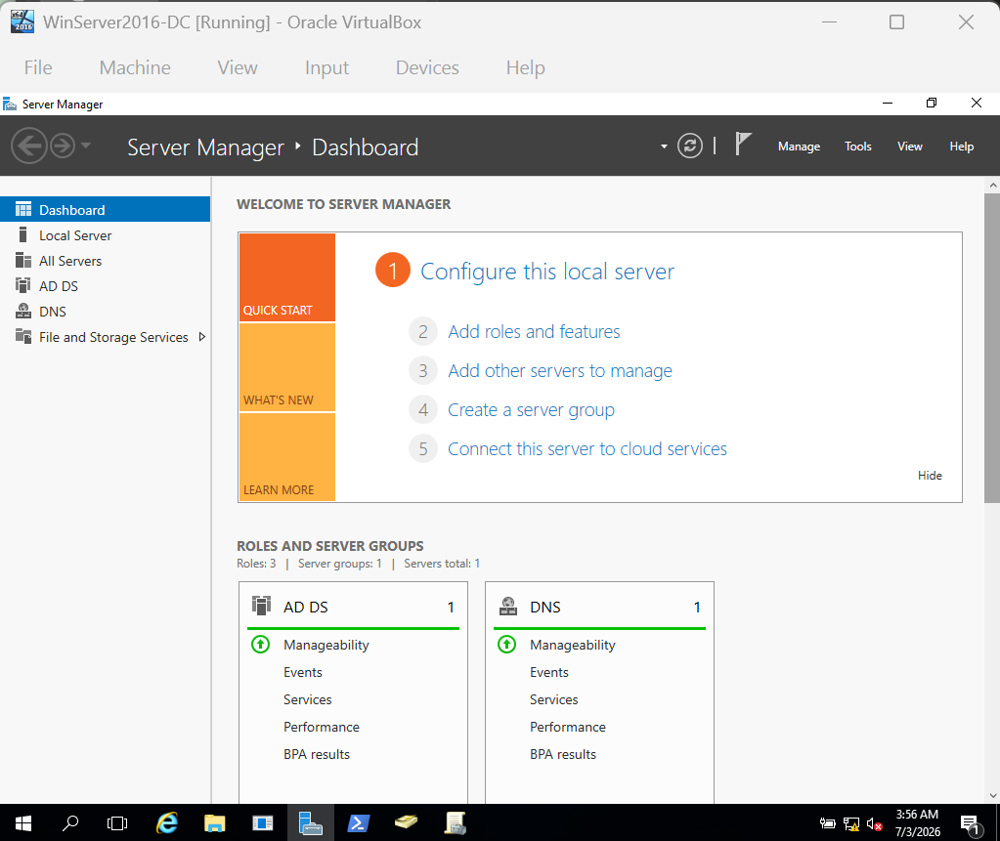
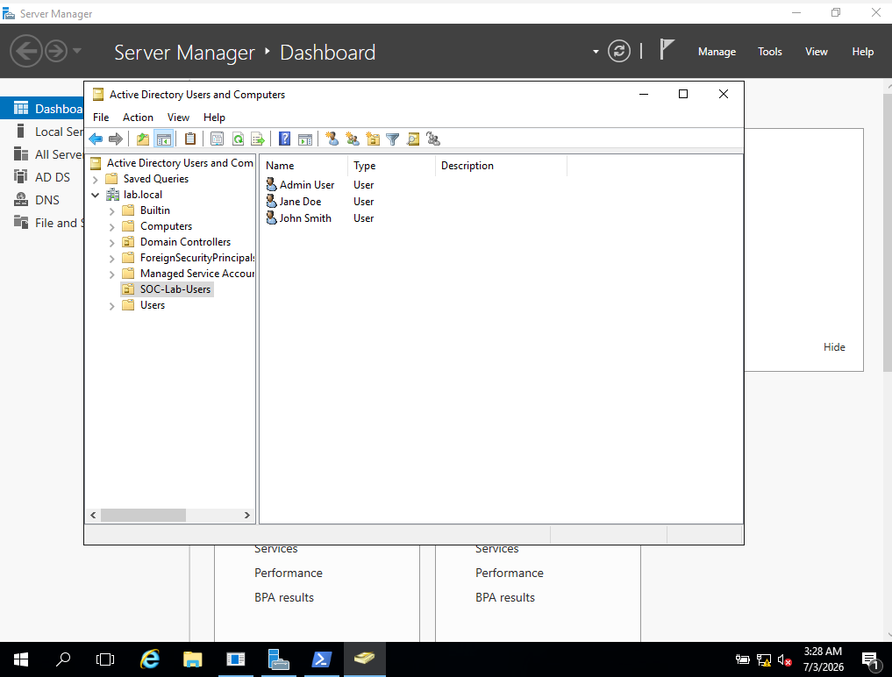
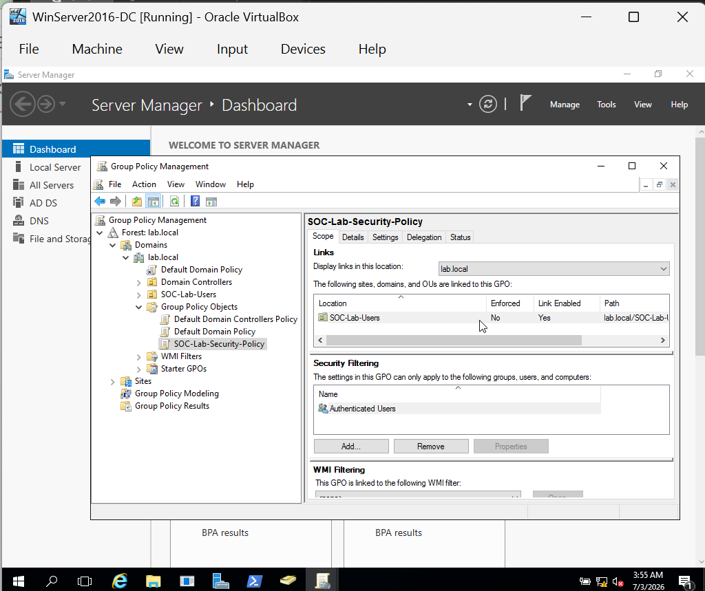
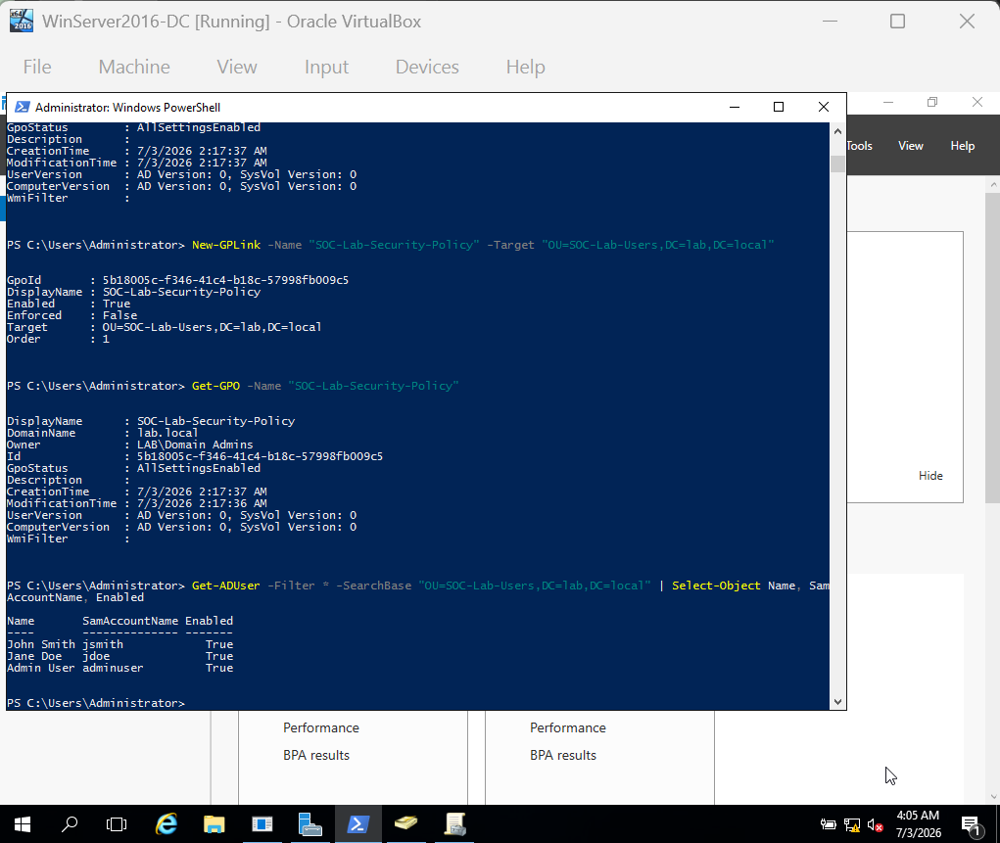

# Active Directory Home Lab — Attack and Defence

**Author:** Frank Ewasy Odoom Jnr (Pixelz)  
**GitHub:** github.com/PixelzJnr

---

## Overview

A hands-on Active Directory home lab built to simulate real-world Windows domain attacks and detect them using event logs and Wazuh SIEM. The lab replicates a typical enterprise environment with a domain controller, domain users, group policies, and an attacker machine.

---

## Network Architecture

| Machine | OS | IP | Role |
|---|---|---|---|
| DC01 | Windows Server 2016 | 192.168.56.10 | Domain Controller, DNS, AD DS |
| Kali Linux | Kali 2026.1 | 192.168.56.30 | Attacker |

## Domain Details

| Setting | Value |
|---|---|
| Domain | lab.local |
| Domain Controller | DC01 |
| Organisational Unit | SOC-Lab-Users |
| Domain Admins | Administrator, adminuser |

---

## Screenshots

### Server Manager Dashboard

### Active Directory Users and Computers

### Group Policy Management

### Domain Users via PowerShell

---

## Users Created

| Name | Username | Role |
|---|---|---|
| John Smith | jsmith | Standard user |
| Jane Doe | jdoe | Standard user |
| Admin User | adminuser | Domain Admin |

---

## Tools Used

- Windows Server 2016 Datacenter Evaluation
- Active Directory Domain Services (AD DS)
- Group Policy Management
- Kali Linux 2026.1
- BloodHound (planned)
- Mimikatz (planned)
- MITRE ATT&CK framework

---

## Attacks Planned

- Password spraying against domain users
- Kerberoasting
- Pass-the-Hash
- BloodHound enumeration
- Privilege escalation via misconfigurations

---

## Group Policy

A security GPO named **SOC-Lab-Security-Policy** was created and linked to the SOC-Lab-Users OU to enforce baseline security settings across domain users.

---

## Next Steps

- Join a Windows 10 client to the domain
- Run BloodHound to map attack paths
- Simulate Kerberoasting and detect it via event logs
- Integrate Wazuh agent on DC01 for centralised alerting

---

## Author

Frank Ewasy Odoom Jnr (Pixelz)  
[github.com/PixelzJnr](https://github.com/PixelzJnr)